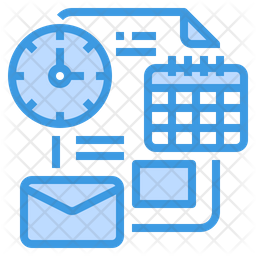

<p align="center">
  <a href="http://nestjs.com/" target="blank"></a>
</p>

<h3 align="center">
  NestJS Application API to manage tasks.
</h3>

<p align="center">The best way to manage tasks!</p>

<p align="center">
  

  <a href="https://www.linkedin.com/in/diego-junges/" target="_blank" rel="noopener noreferrer">
    
  </a>

  

  <a href="https://github.com/DiegoJunges/gobarber-api/commits/master">
    
  </a>

  <a href="https://github.com/DiegoJunges/gobarber-api/issues">
    
  </a>

  
</p>

## Description

## 📑✅ About the project

This api provides everything needed to manage tasks.

## 🚀 Technologies

Technologies that I used to develop this api

- [Node.js](https://nodejs.org/en/)
- [Nest.js](https://nodejs.org/en/)
- [TypeScript](https://www.typescriptlang.org/)
- [TypeORM](https://typeorm.io/#/)
- [JWT-token](https://jwt.io/)
- [PostgreSQL](https://www.postgresql.org/)
- [Jest](https://jestjs.io/)
- [SuperTest](https://github.com/visionmedia/supertest)
- [Bcrypt.js](https://github.com/dcodeIO/bcrypt.js/)
- [Eslint](https://eslint.org/)
- [Prettier](https://prettier.io/)

## Installation

```bash
$ yarn
```

## Running the app

```bash
# development
$ yarn start

# watch mode
$ yarn start:dev

# production mode
$ yarn start:prod
```
## 💻 Getting started

Import the `Insomnia.json` on Insomnia App or click on [Run in Insomnia](#insomniaButton) button

### Requirements

- [Node.js](https://nodejs.org/en/)
- [Yarn](https://classic.yarnpkg.com/) or [npm](https://www.npmjs.com/)
- One instance of [PostgreSQL](https://www.postgresql.org/)

> Obs.: I recommend use docker

**Clone the project and access the folder**

```bash
$ git clone https://github.com/DiegoJunges/taskmanagement-api.git && cd taskmanagement-api
```

**Follow the steps below**

```bash
# Install the dependencies
$ yarn

# Make a copy of '.env.example' to '.env'
# and set with YOUR environment variables.
# The aws variables do not need to be filled for dev environment
$ cp .env.example .env

# Create the instance of postgreSQL using docker
$ docker run --name postgres -e POSTGRES_USER=docker \
              -e POSTGRES_DB=gobarber -e POSTGRES_PASSWORD=docker \
              -p 5432:5432 -d postgres


# To finish, run the api service
$ yarn start

# Well done, project is started!
```
## Test

```bash
# unit tests
$ npm run test

# e2e tests
$ npm run test:e2e

# test coverage
$ npm run test:cov
```

## 🤔 How to contribute

**Make a fork of this repository**

```bash
# Fork using GitHub official command line
# If you don't have the GitHub CLI, use the web site to do that.

$ gh repo fork DiegoJunges/taskmanagement-api
```

**Follow the steps below**

```bash
# Clone your fork
$ git clone your-fork-url && cd taskmanagement-api

# Create a branch with your feature
$ git checkout -b my-feature

# Make the commit with your changes
$ git commit -m 'feat: My new feature'

# Send the code to your remote branch
$ git push origin my-feature
```

After your pull request is merged, you can delete your branch

## 📝 License

This project is licensed under the MIT License - see the [LICENSE](LICENSE) file for details.

---

Made with 💜 &nbsp;by Diego Junges 👋 &nbsp;[See my linkedin](https://www.linkedin.com/in/diego-junges/)
